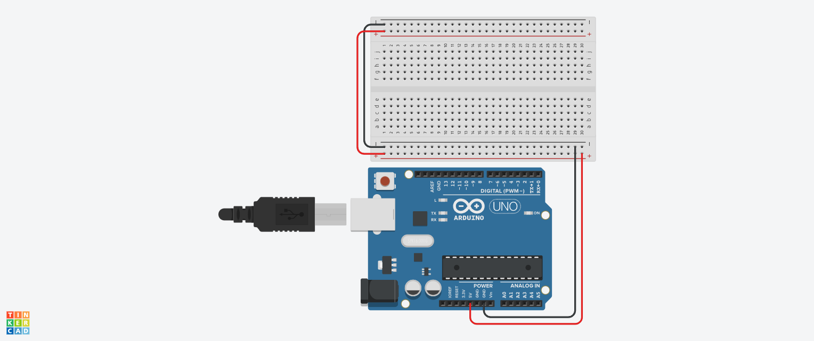
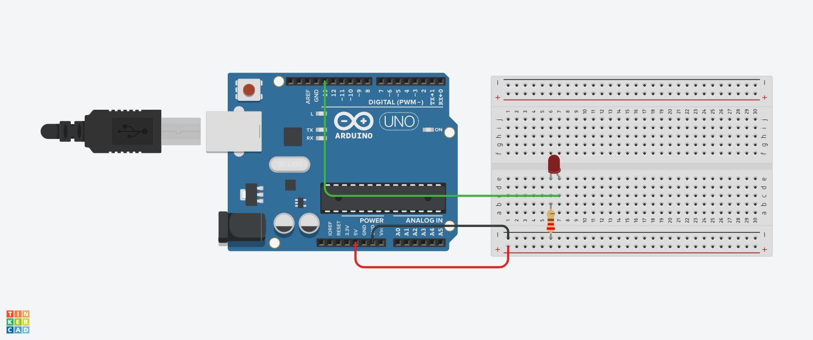
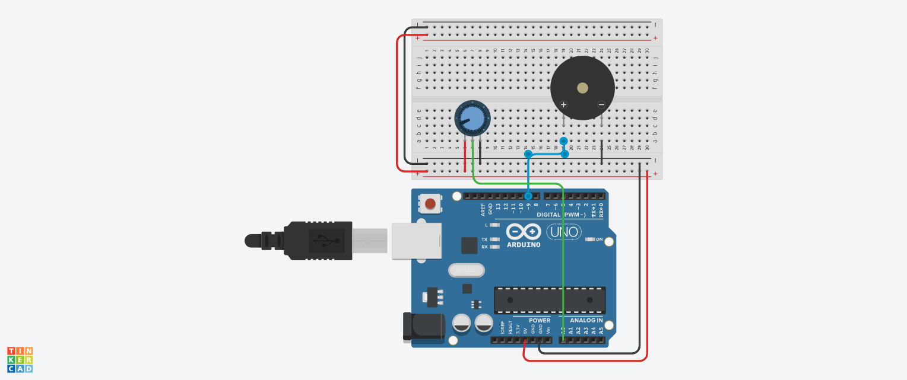
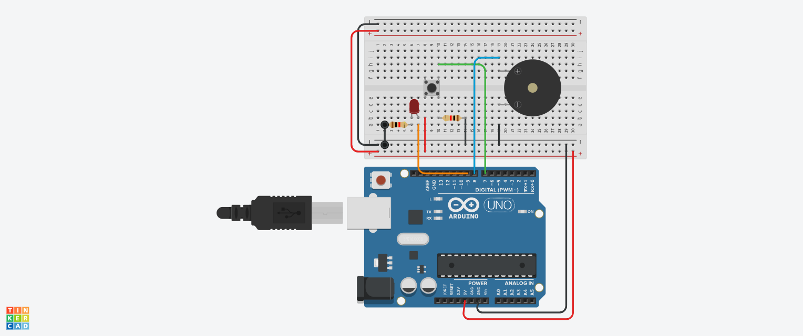
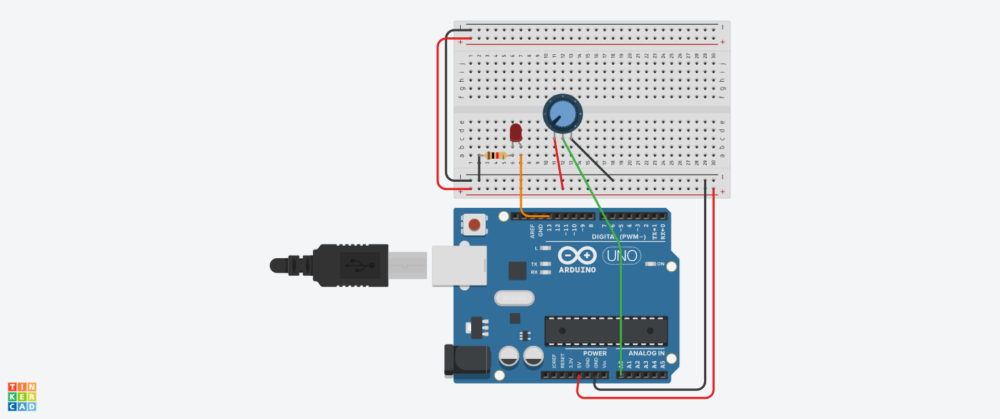

# Semillero de Robótica


## Índice

1. [Arduino](#arduino)
   - [¿Qué es Arduino?](#qué-es-arduino)
2. [C++](#c)
   - [¿Qué es C++?](#qué-es-c)
   - [Estructura básica](#estructura-básica)
3. [Electrónica básica](#electrónica-básica)
   - [Elementos básicos](#elementos-básicos)
   - [Uso de la Breadboard Pequeña](#uso-de-la-breadboard-pequeña)
   - [Identificación de la Polaridad del LED](#identificación-de-la-polaridad-del-led)
4. [Retos](#retos)
   - [Prender un LED](#reto-prender-un-led)
     - [Diagrama](#diagrama)
   - [Variar sonido](#reto-variar-sonido)
     - [Diagrama](#diagrama-1)
   - [Hacer timbre](#reto-hacer-timbre)
     - [Diagrama](#diagrama-2)
   - [Reto extra: Prender LED al potenciómetro](#reto-extra-prender-led-al-potenciómetro)
     - [Diagrama](#diagrama-3)

## Arduino

### ¿Qué es Arduino?

Arduino es una plataforma de <span title="Hardware se refiere a la parte física de una computadora o dispositivo electrónico, incluyendo componentes como circuitos, placas, y dispositivos periféricos.">hardware</span> libre que permite crear proyectos electrónicos de manera sencilla. Consta de una serie de placas de circuito (como la Arduino Uno) y un entorno de desarrollo que facilita la programación y el control de dispositivos electrónicos.

### C++

#### ¿Qué es C++?

C++ es un lenguaje de programación de propósito general que es ampliamente utilizado en el desarrollo de <span title="Software se refiere a los programas y sistemas operativos que se ejecutan en un dispositivo, permitiendo que el hardware realice tareas específicas.">software</span> y sistemas. Permite la programación orientada a objetos, lo que facilita la creación de programas modulares y reutilizables.

#### Estructura básica

La estructura básica de un programa en C++ incluye funciones como `<span title="main() es la función principal en un programa en lenguajes como C y C++, donde comienza la ejecución del código.">main()</span>`, donde comienza la ejecución del programa, y se compone de declaraciones de variables, funciones y control de flujo.

### Electrónica básica

#### Elementos básicos

En electrónica básica, se utilizan componentes como <span title="Resistencias son componentes electrónicos que limitan el flujo de corriente en un circuito. Se utilizan para proteger otros componentes y ajustar niveles de señal.">resistencias</span>, <span title="Capacitores son componentes electrónicos que almacenan energía en forma de carga eléctrica. Se utilizan para filtrar señales, suavizar voltajes y almacenar energía temporalmente.">capacitores</span>, LEDs, potenciómetros y <span title="Buzzer es un dispositivo electroacústico que convierte señales eléctricas en sonido. Se utiliza en circuitos electrónicos para emitir alertas sonoras.">buzzer</span>. Estos elementos son esenciales para la creación de circuitos simples.

#### Uso de la Breadboard Pequeña

La **breadboard pequeña** es una herramienta esencial para crear prototipos de circuitos. Se utiliza para realizar conexiones temporales sin necesidad de soldadura. Aquí tienes algunos puntos clave para su uso:

1. **Filas y columnas**: Las filas horizontales se utilizan para la alimentación positiva y tierra, mientras que las columnas verticales conectan componentes.

2. **Conexión de energía**: Conecta los pines de **<span title="5V se refiere a una tensión eléctrica de cinco voltios, comúnmente utilizada en circuitos electrónicos para alimentar componentes.">5V</span>** y **<span title="GND significa 'tierra' en circuitos eléctricos, y se refiere al punto de referencia de voltaje cero, donde se conecta el lado negativo de la fuente de alimentación.">GND</span>** del Arduino a las filas horizontales de la breadboard para establecer una referencia de energía.

3. **Colocación de componentes**: Inserta componentes como resistencias, LEDs y potenciómetros en las filas y columnas para crear circuitos.



#### Identificación de la Polaridad del LED

Para conectar un LED correctamente, debes identificar su polaridad:

1. **Longitud de las patas**: La pata larga es el **<span title="El ánodo es el terminal positivo de un dispositivo eléctrico, como un LED, donde la corriente entra al componente.">ánodo</span>** (positivo) y se conecta a la alimentación; la pata corta es el **<span title="El cátodo es el terminal negativo de un dispositivo eléctrico, como un LED, donde la corriente sale del componente.">cátodo</span>** (negativo) y se conecta a tierra.

2. **Bisel o borde plano**: El lado con el borde plano indica el **<span title="El cátodo es el terminal negativo de un dispositivo eléctrico, como un LED, donde la corriente sale del componente.">cátodo</span>** (negativo).

3. **Interior del LED**: La parte metálica más grande interna corresponde al <span title="El cátodo es el terminal negativo de un dispositivo eléctrico, como un LED, donde la corriente sale del componente.">cátodo</span>(negativo).

### Retos

#### Reto: Prender un LED

##### Elementos

- **LED**
- **Breadboard pequeña**
- **Resistencia (220 <span title="Ohmios es la unidad de medida de resistencia eléctrica, que indica cuánta oposición ofrece un material al flujo de corriente.">ohmios</span>)**
- **Cables de conexión**
- **Arduino 1**

##### Explicación

Para prender un LED, es necesario conectarlo correctamente a la breadboard y al Arduino. Es fundamental identificar la polaridad del LED y utilizar una resistencia para protegerlo.

##### Código

```cpp
// Código para prender un LED
int ledPin = 13; // Pin conectado al LED

void setup() {
  pinMode(ledPin, OUTPUT); // Configurar el pin como salida
}

void loop() {
  digitalWrite(ledPin, HIGH); // Prender el LED
  delay(1000); // Esperar un segundo
  digitalWrite(ledPin, LOW); // Apagar el LED
  delay(1000); // Esperar un segundo
}
```

##### Diagrama



#### Reto: Variar sonido

##### Elementos

- **Buzzer pasivo**
- **Potenciómetro**
- **Cables de conexión**
- **Arduino 1**

##### Explicación

El buzzer se utiliza para emitir sonidos, y su frecuencia puede ser controlada mediante un potenciómetro. El potenciómetro permite ajustar el voltaje de salida, variando el sonido emitido.

##### Código

```cpp
// Código para variar el sonido con un potenciómetro
int buzzerPin = 9; // Pin conectado al buzzer
int potPin = A0; // Pin conectado al potenciómetro

void setup() {
  pinMode(buzzerPin, OUTPUT); // Configurar el pin como salida
}

void loop() {
  int potValue = analogRead(potPin); // Leer valor del potenciómetro
  int frequency = map(potValue, 0, 1023, 100, 1000); // Mapear el valor
  tone(buzzerPin, frequency); // Emitir sonido
}
```

##### Diagrama




#### Reto: Hacer timbre

##### Elementos

- **Buzzer pasivo**
- **LED**
- **Pulsador**
- **Resistor de 10kΩ**
- **Cables de conexión**
- **Arduino 1**

##### Explicación

Este reto consiste en crear un timbre que emita un sonido y encienda un LED al ser activado mediante un pulsador. Cuando el pulsador se presiona, el buzzer sonará y el LED se encenderá.

##### Código

```cpp
// Código para hacer un timbre con pulsador
int buzzerPin = 9; // Pin conectado al buzzer
int ledPin = 13; // Pin conectado al LED
int buttonPin = 2; // Pin conectado al pulsador
int buttonState = 0; // Variable para almacenar el estado del botón

void setup() {
  pinMode(buzzerPin, OUTPUT); // Configurar el pin del buzzer como salida
  pinMode(ledPin, OUTPUT); // Configurar el pin del LED como salida
  pinMode(buttonPin, INPUT); // Configurar el pin del pulsador como entrada
}

void loop() {
  buttonState = digitalRead(buttonPin); // Leer el estado del pulsador

  if (buttonState == HIGH) { // Si el pulsador está presionado
    digitalWrite(buzzerPin, HIGH); // Activar el buzzer
    digitalWrite(ledPin, HIGH); // Encender el LED
  } else {
    digitalWrite(buzzerPin, LOW); // Desactivar el buzzer
    digitalWrite(ledPin, LOW); // Apagar el LED
  }
}
```

##### Instrucciones de Conexión

1. **Buzzer**:
   - Conectar el pin positivo del buzzer al **pin 9** del Arduino.
   - Conectar el pin negativo del buzzer a **GND**.

2. **LED**:
   - Conectar el ánodo (lado más largo) del LED al **pin 13** del Arduino.
   - Conectar el cátodo (lado más corto) a un **resistor de 220Ω** y luego a **GND**.

3. **Pulsador**:
   - Conectar un terminal del pulsador al **pin 2** del Arduino.
   - Conectar el otro terminal del pulsador a **GND**.
   - Conectar un **resistor de 10kΩ** entre el pin 2 y **5V** para usarlo como pull-up.


##### Diagrama


#### Reto extra: Prender LED al potenciómetro

##### Elementos

- **Buzzer pasivo**
- **LED**
- **Potenciómetro**
- **Cables de conexión**
- **Arduino 1**

##### Explicación

Este reto consiste en encender un LED cuando el potenciómetro se ajusta a un cierto nivel. Esto implica leer el valor del potenciómetro y activar el LED cuando el valor supera un umbral específico.

##### Código

```cpp
// Código para prender LED con el potenciómetro
int ledPin = 13; // Pin conectado al LED
int potPin = A0; // Pin conectado al potenciómetro

void setup() {
  pinMode(ledPin, OUTPUT); // Configurar el pin como salida
}

void loop() {
  int potValue = analogRead(potPin); // Leer valor del potenciómetro
  if (potValue > 512) { // Si el valor supera un umbral
    digitalWrite(ledPin, HIGH); // Prender el LED
  } else {
    digitalWrite(ledPin, LOW); // Apagar el LED
  }
}
```

##### Diagrama



